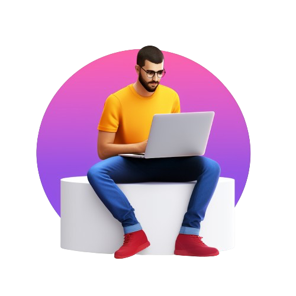

<!-------------------------------------------------------------------------------------------------------------------------------------------------->
<!----- Shivam's Icon ------------------------------------------------------------------------------------------------------------------------------>
<!-------------------------------------------------------------------------------------------------------------------------------------------------->

  <div>
    <div align="center">
        <a href="https://github.com/myselshivams"></a>
    </div>
    
<!-------------------------------------------------------------------------------------------------------------------------------------------------->
<!----- Shivam's Profile Bar ----------------------------------------------------------------------------------------------------------------------->
<!-------------------------------------------------------------------------------------------------------------------------------------------------->
  &nbsp;&nbsp;&nbsp;&nbsp;&nbsp;
  <a href="https://itshivam.tech" target="_blank">
        
    </a>

<!-------------------------------------------------------------------------------------------------------------------------------------------------->
<!----- Read-me Typing ------------------------------------------------------------------------------------------------------------------------------>
<!-------------------------------------------------------------------------------------------------------------------------------------------------->
 
  <div align="center">
        <a href="https://github.com/myselfshivams"></a>
    </div>

<!-------------------------------------------------------------------------------------------------------------------------------------------------->
<!----- Intro -------------------------------------------------------------------------------------------------------------------------------------->
<!-------------------------------------------------------------------------------------------------------------------------------------------------->

<h3 align="center">
        <samp>&gt; Hey There!, I am
                <b><a target="_blank" href="https://www.linkedin.com/in/itshivam/">Shivam</a></b>
        </samp>
</h3>

<!-- Search  -->
<p align="center"> 
  <samp>
    <a href="https://www.linkedin.com/in/itshivam/">「 Connect with me 」</a>
    <br>
    「 I am iOS and Android Developer & full stack Web Developer 」
    <br>
    
  </samp>
</p>

<div>

  <h3 align="center">Relentless debugger 🔧📖 Perpetual evolver, questing for pixel-perfect perfection!📚 💻</h3>

<!---------------------------------------------------------------------------------------------------------------------------------------------------------->
<!----- Footer Bar  --------------------------------------------------------------------------------------------------------------------------------------->
<!---------------------------------------------------------------------------------------------------------------------------------------------------------->

 <p align="center"><a href="https://github.com/myselfshivams"></a></p>
 

<!---------------------------------------------------------------------------------------------------------------------------------------------------------->
<!----- Visitor Badge + Links ------------------------------------------------------------------------------------------------------------------------------>
<!---------------------------------------------------------------------------------------------------------------------------------------------------------->
  
<hr>
<div align="center">
  
    <br><br>
  <a href="https://dev.to/itshivam"></a>
  <a href="https://www.linkedin.com/in/itshivam/"></a>
  <a href="mailto:founder@echotratech.com"></a>

</div>
<hr>
  
</div>

<!---------------------------------------------------------------------------------------------------------------------------------------------------------->
<!----- About me ------------------------------------------------------------------------------------------------------------------------------------------->
<!---------------------------------------------------------------------------------------------------------------------------------------------------------->
<hr>
<div align="centre">
        <ul>
            <li>🔭 <b>I’m currently working on</b>: Next.js, Django, Golang, SwiftUI</li>
            <li>🌱 <b>I’m currently learning</b>: DevOps, Framer Motion.</li>
            <li>💬 <b>Ask me about</b>: Web Development, iOS Developments, App Development and Competetive Programming.</li>
            <li>📫 <b>How to reach me</b>: Catch and follow me from the above links 👆, in addition to follow me here.</li>
            <li>🤔 <b>I’m currently open for</b>: pen Source Projects</li>
            <li>👨‍💻 <b>All of my projects are available at</b>: <a href="https://itshivam.me">My Portfolio</a>.</li>
        </ul>  
<hr>
  
<!-- Skill Set  -->
<div align="center">
    <h1>Skill Set &nbsp;  </h1>
    <h4>These technologies represent my expertise and hands-on experience. They've been integral to my work, enabling me to deliver impactful solutions. </h4>
</div>

<!---------------------------------------------------------------------------------------------------------------------------------------------------------->
<!----- Shivam's Tech Stack Table    ----------------------------------------------------------------------------------------------------------------------->
<!---------------------------------------------------------------------------------------------------------------------------------------------------------->

<table>
<div style="display: flex; align-items: flex-start; align: center">
<table align="center">
  <tr>
    <td align="center" width="96">
        
      <br>C++
    </td>
    <td align="center" width="96">
      <a href="https://www.python.org/">
        
      </a>
      <br>Python
    </td>
    <td align="center" width="96">
        
      <br>JavaScript
    </td>
    <td align="center" width="96">
        
      <br>TypeScript
    </td>
    <td align="center" width="96">
        
      <br>Swift
    </td>
    <td align="center" width="96">
        
      <br>Golang
    </td>
    <td align="center" width="96">
        
      <br>MySQL
    </td>
    <td align="center" width="96">
        
      <br>MongoDB
    </td>
    <td align="center" width="96">
        
      <br>PostgreSQL
    </td>
  </tr>
  <tr>
  <td align="center" width="96">
        
      <br>HTML
    <td align="center" width="96">
        
      <br>CSS
    </td>
    <td align="center" width="96"> 
        
      <br>BootStrap
    </td>
    <td align="center"  width="96">
        
      <br>React
    </td>
    <td align="center"  width="96">
        
      <br>Redux
    </td>
    <td align="center" width="96">
        
      <br>NextJS
    </td>
    <td align="center"  width="96">
        
      <br>TailWind CSS
    </td>
    <td align="center" width="96">
        
      <br>Three.js
    </td>
    <td align="center" width="96">
        
      <br>jQuery
    </td>
  </tr>
 <tr>
      <td align="center" width="96">
        
      <br>Github
    </td>
        <td align="center" width="96">
        
      <br>Nodejs
      </td>
      </td>
    <td align="center" width="96">
        
      <br>ExpreeJS
    </td>
            <td align="center" width="96">
        
      <br>Django
    </td>
              <td align="center" width="96">
        
      <br>REST
    </td>
              <td align="center" width="96">
        
      <br>GraphQL
  <td align="center" width="96">
      <a href="#macropower-tech">
        
      </a>
      <br>AWS
    </td>
              <td align="center" width="96">
        
      <br>Docker
    </td>
    <td align="center" width="96">
        
      <br>Kubernetes
    </td>
 </tr>
</table>


<!-- Skill Set  (Programming Languages)  -->
<div align="center">
    <h3><b>Programming Languages</b></h3>
    <code><a href="#" target="_blank"></a></code>&nbsp;
    <code><a href="#" target="_blank"> </a></code>&nbsp;
    <code><a href="#" target="_blank"></a></code>&nbsp;&nbsp;
    <code><a href="#" target="_blank"></a></code>&nbsp;&nbsp;
  </a> 
  <code><a href="#" target="_blank" rel="noreferrer"> </a></code>&nbsp;&nbsp; 
<code><a href="#" target="_blank" rel="noreferrer">  </a> </code>&nbsp;
  <code><a href="#" target="_blank"></a></code>&nbsp;&nbsp;
</div>
</div>

<!-- Skill Set (Frontend)  -->
<div align="center">
    <h3><b>Frontend Development</b></h3>
    <code><a href="#" target="_blank"></a></code>&nbsp;
    <code><a href="#" target="_blank"> </a></code>&nbsp;
    <code><a href="#" target="_blank"></a></code>&nbsp;
  
</div>
<br>

<!-- Skill Set (App Development)  -->
<div align="center">
    <h3><b>App Development </b></h3>
    <code><a href="#" target="_blank" rel="noreferrer"> </a></code>&nbsp;&nbsp; 
    <code><a href="#" target="_blank" rel="noreferrer">  </a></code>&nbsp;
    <code><a href="#" target="_blank" rel="noreferrer">  </a></code>&nbsp;
    <code><a href="#" target="_blank" rel="noreferrer">  </a></code>&nbsp;
    <code><a href="#" target="_blank" rel="noreferrer">  </a></code>&nbsp;
</div>
    <br>
  
<!-- Skill Set (L&F)  -->
<div align="center">
    <h3><b>Libraries and Frameworks</b></h3>
    <code><a href="#" target="_blank"> </a></code>&nbsp;
      <code><a href="#" target="_blank" rel="noreferrer">  </a></code>
      <code><a href="#" target="_blank"> </a></code>&nbsp;
    <code><a href="#" target="_blank" rel="noreferrer">  </a></code>&nbsp;
    <code><a href="#" target="_blank"></a></code>&nbsp;
    <code><a href="#" target="_blank"></a></code>&nbsp;
    <code><a href="#" target="_blank"></a></code>&nbsp;
     <code><a href="#" target="_blank"></a></code>&nbsp;
</div>
<br>

<!-- Skill Set (Database)  -->
<div align="center">
    <h3><b>Databases</b></h3>
    <code><a href="#" target="_blank" rel="noreferrer"> </a></code>&nbsp;
    <code><a href="#" target="_blank"></a></code>&nbsp;
      <code><a href="#" target="_blank"></a></code>&nbsp;
   <code><a #="#" target="_blank"> </a></code>&nbsp
</div>
<br>

<!-- Skill Set (Cloud)  -->
<div align="center">
    <h3><b>Cloud</b></h3>
    <code><a href="#" target="_blank"></a></code>&nbsp;
    <code><a href="#" target="_blank" rel="noreferrer">  </a></code>&nbsp;
      <code><a href="#" target="_blank" rel="noreferrer">  </a></code>&nbsp;&nbsp;
        <code><a href="#" target="_blank" rel="noreferrer">  </a></code>&nbsp;&nbsp;
  <code><a href="#" target="_blank"> </a></code>&nbsp;
    <code><a href="#" target="_blank"></a></code>&nbsp;
</div>
<br>

<!-- Skill Set (Tools)  -->
<div align="center">
    <h3><b>Tools</b></h3>
    <code><a href="#" target="_blank"></a></code>&nbsp;
    <code><a href="#" target="_blank"></a></code>&nbsp;
    <code><a href="#" target="_blank"></a></code>&nbsp;
    <code><a href="#" target="_blank"> </a></code>&nbsp;
    <code><a href="#" target="_blank"> </a></code>&nbsp;
</div>
<br>

<div align="center">
    <h3><b>DevOps Tools</b></h3>
    <code><a href="#" target="_blank"></a></code>&nbsp;
    <code><a href="#" target="_blank"></a></code>&nbsp;
    <code><a href="#" target="_blank"></a></code>&nbsp;
    <code><a href="#" target="_blank"> </a></code>&nbsp;
    <code><a href="#" target="_blank"> </a></code>&nbsp;
    <br><br>
</div>

<div align="center">
    <h3><b>Operating Systems</b></h3>
    <code><a href="#" target="_blank"></a></code>&nbsp;
    <code><a href="#" target="_blank"></a></code>&nbsp;
    <code><a href="#" target="_blank" rel="noreferrer">  </a></code>&nbsp;
    <code><a href="#" target="_blank" rel="noreferrer">  </a></code>&nbsp;
    <br><br>
</div>
    <br><br>
</div>
</div>
<hr>

<!-- About me  -->

```js
About Me = {
"I find joy in crafting elegant solutions through the art of coding.",
"Proficient in languages like Python and C++, I navigate the digital realm with expertise.",
"My expertise extends to the intricate web technologies of NextJS, Golang, and DevOps, where I blend creativity and functionality seamlessly.",
"I am more than a student; I am a creator, a problem solver, and a Developer."
"Together, let's push the boundaries of what's possible and shape a future powered by code. ✨"
}
```

<hr>
<div align="center">


#  GitHub Stats
<details>
<p align="center">
  <a href="https://github.com/myselfshivams">
    
  </a>
</p>

<p align="center">
  <a href="https://github.com/myselfshivams">
    
  </a>
</p>

<hr>
<div align="center">
<a> 
<!--     <a href="https://github.com/myselfshivams"></a> -->

  <div align="center">
  <a href="https://github.com/myselfshivams"></a>
  <br>
</a>

<!--------------------------------------------------------------------------------------------------------------------------------------------------------->
<!--- Shivam's Quotes ----------------------------------------------------------------------------------------------------------------------------->
<!--------------------------------------------------------------------------------------------------------------------------------------------------------->

  <hr><div align="center">

#  Technology Joke


<hr>

#  Developers' Quotes

[](https://github.com/piyushsuthar/github-readme-quotes)
</div>

<!--------------------------------------------------------------------------------------------------------------------------------------------------------->
<!--- Shivam's Activity Graph ----------------------------------------------------------------------------------------------------------------------------->
<!--------------------------------------------------------------------------------------------------------------------------------------------------------->


<!--- ------------------------------------------------------------------------------------------------------------------------------------------------------ -->
<!--- -- Metrics ------------------------------------------------------------------------------------------------------------------------------------------- -->
<!--- ------------------------------------------------------------------------------------------------------------------------------------------------------ -->


#  My GitHub Metrics
</details>


| Overview | Follow up Issues & PRs |
|:--------:|:-------------------------:|
|  |  |
| Leetcode Stats | Notable Contributions |
|  |  |
| Achievements | Language Activity |
|  |  |
| Discussions | Reactions |
|  |  |

                  
<br>

<!--------------------------------------------------------------------------------------------------------------------------------------------------------->
<!--- Shivam's Coding Profiles   ----------------------------------------------------------------------------------------------------------------------------->
<!--------------------------------------------------------------------------------------------------------------------------------------------------------->
## Coding Profiles📈
<details>
<span>
<a href="https://codeforces.com/profile/">

</a>
<a href="https://leetcode.com/u/itshivam/">

</a>
</details>
<!--------------------------------------------------------------------------------------------------------------------------------------------------------->
<!--- Shivam's GSSOC Badges   ----------------------------------------------------------------------------------------------------------------------------->
<!--------------------------------------------------------------------------------------------------------------------------------------------------------->


## GSSOC(24) Badges 🪶
<div style='display:flex; align-items:center; gap: 10px;' align='center'><a href="https://gssoc.girlscript.tech/leaderboard">

  
  
  
  
  
  
  </a>
</div>

<hr>
<br>

<!--------------------------------------------------------------------------------------------------------------------------------------------------------->
<!--- Shivam's HacktoberFest  ----------------------------------------------------------------------------------------------------------------------------->
<!--------------------------------------------------------------------------------------------------------------------------------------------------------->

[](https://holopin.io/@myselfshivams)


<!--------------------------------------------------------------------------------------------------------------------------------------------------------->
<!--- Shivam's WAKA TIME STATS ----------------------------------------------------------------------------------------------------------------------------->
<!--------------------------------------------------------------------------------------------------------------------------------------------------------->

#  WakaTime Stats


<details>
 <h1><summary>Shivam's Stats</summary> </h1> 

  
<!--START_SECTION:waka-->


**🐱 My GitHub Data** 

> 📦 1.7 MB Used in GitHub's Storage 
 > 
> 🏆 894 Contributions in the Year 2025
 > 
> 💼 Opted to Hire
 > 
> 📜 72 Public Repositories 
 > 
> 🔑 48 Private Repositories 
 > 
**I'm an Early 🐤** 

```text
🌞 Morning                955 commits         ██████░░░░░░░░░░░░░░░░░░░   23.79 % 
🌆 Daytime                1227 commits        ████████░░░░░░░░░░░░░░░░░   30.57 % 
🌃 Evening                1578 commits        ██████████░░░░░░░░░░░░░░░   39.31 % 
🌙 Night                  254 commits         ██░░░░░░░░░░░░░░░░░░░░░░░   06.33 % 
```
📅 **I'm Most Productive on Sunday** 

```text
Monday                   363 commits         ██░░░░░░░░░░░░░░░░░░░░░░░   09.04 % 
Tuesday                  462 commits         ███░░░░░░░░░░░░░░░░░░░░░░   11.51 % 
Wednesday                368 commits         ██░░░░░░░░░░░░░░░░░░░░░░░   09.17 % 
Thursday                 514 commits         ███░░░░░░░░░░░░░░░░░░░░░░   12.81 % 
Friday                   410 commits         ███░░░░░░░░░░░░░░░░░░░░░░   10.21 % 
Saturday                 559 commits         ███░░░░░░░░░░░░░░░░░░░░░░   13.93 % 
Sunday                   1338 commits        ████████░░░░░░░░░░░░░░░░░   33.33 % 
```


📊 **This Week I Spent My Time On** 

```text
🕑︎ Time Zone: Asia/Kolkata

💬 Programming Languages: 
TypeScript               4 hrs 31 mins       ████████████████████░░░░░   81.49 % 
Python                   37 mins             ███░░░░░░░░░░░░░░░░░░░░░░   11.25 % 
JSON                     12 mins             █░░░░░░░░░░░░░░░░░░░░░░░░   03.67 % 
Git Config               10 mins             █░░░░░░░░░░░░░░░░░░░░░░░░   03.10 % 
CSS                      1 min               ░░░░░░░░░░░░░░░░░░░░░░░░░   00.46 % 

🔥 Editors: 
VS Code                  5 hrs 32 mins       █████████████████████████   100.00 % 

🐱‍💻 Projects: 
Dev Themed Portfolio     3 hrs 19 mins       ███████████████░░░░░░░░░░   59.83 % 
eshielded-prod           1 hr 28 mins        ███████░░░░░░░░░░░░░░░░░░   26.63 % 
Jobs Apllied             37 mins             ███░░░░░░░░░░░░░░░░░░░░░░   11.24 % 
gasless-forwarder        7 mins              █░░░░░░░░░░░░░░░░░░░░░░░░   02.28 % 
kkk                      0 secs              ░░░░░░░░░░░░░░░░░░░░░░░░░   00.02 % 

💻 Operating System: 
Mac                      5 hrs 32 mins       █████████████████████████   100.00 % 
```

**I Mostly Code in TypeScript** 

```text
TypeScript               59 repos            █████████░░░░░░░░░░░░░░░░   36.88 % 
JavaScript               59 repos            █████████░░░░░░░░░░░░░░░░   36.88 % 
Go                       7 repos             █░░░░░░░░░░░░░░░░░░░░░░░░   04.38 % 
CSS                      6 repos             █░░░░░░░░░░░░░░░░░░░░░░░░   03.75 % 
Jupyter Notebook         1 repo              ░░░░░░░░░░░░░░░░░░░░░░░░░   00.62 % 
```


**Timeline**


 Last Updated on 06/05/2025 18:53:34 UTC
<!--END_SECTION:waka-->

</details>


<!--------------------------------------------------------------------------------------------------------------------------------------------------------->
<!--- Shivam's Snake Animation Contribution Graph ---------------------------------------------------------------------------------------------------------->
<!--------------------------------------------------------------------------------------------------------------------------------------------------------->


